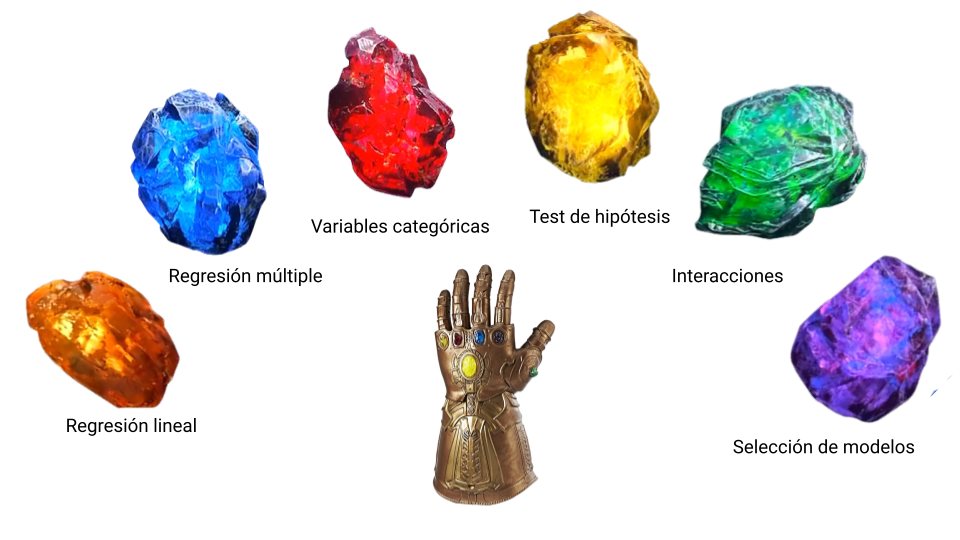
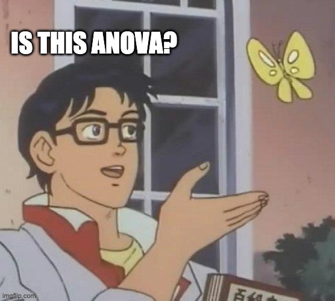

class: center, middle

```{r setup, include=FALSE}
pacman::p_load(xaringanthemer, tidyverse, kableExtra, ggpubr, 
               palmerpenguins, openintro, patchwork, ggtext,
               parameters, effectsize, car)
options(dplyr.width = Inf)
knitr::opts_chunk$set(warning = FALSE, 
                      message = FALSE)

ggplot2::theme_set(ggplot2::theme_minimal(base_size = 13))
ggplot2::theme_update(plot.title = element_markdown(),
                      legend.position = "top")
ggplot2::update_geom_defaults("point", list(color = "#1380A1",
                                            fill = "#1380A1",
                                            size = 3,
                                            alpha = .7))
ggplot2::update_geom_defaults("line", list(color = "#ED6A5A"))
ggplot2::update_geom_defaults("smooth", list(color = "#ED6A5A"))
```

```{r xaringan-themer, include=FALSE, warning=FALSE}
style_duo_accent(primary_color = "#A42339",
                 secondary_color = "#BADEFC",
                 code_highlight_color = "#BADEFC",
                 base_font_size = "18px",
                 text_font_size = "1rem",
                 text_slide_number_font_size = "0.8rem",
                  code_font_size = "0.7rem",
                  code_inline_font_size = "0.7rem",
                 header_h1_font_size = "2.5rem",
                 header_h2_font_size = "2rem",
                 header_h3_font_size = "1.5rem",
                 header_font_google = google_font("Work Sans", "600"),
                 text_font_google = google_font("Work Sans", "300", "300i"),
                 code_font_google = google_font("Fira Mono")
)
```

```{r xaringanExtra, echo = FALSE}
# Progress bar
xaringanExtra::use_progress_bar(color = "#A42339", location = "bottom")

# Extra css classes
extra_css <- list(
  ".pull-left-narrow" = list("float" = "left",
                             "width" = "20%"),
  ".pull-right-wide" = list("float"  = "left",
                             "width" = "75%"),
  ".small" = list("font-size"  = "90%"),
  ".big" = list("font-size"  = "120%"),
  ".huge" = list("font-size"  = "150%"),
  ".full-width" = list("display" = "flex",
                       "width"   = "100%",
                       "flex"    = "1 1 auto"),
  ".content" = list("position"   = "relative",
                    "top"        = "50%",
                    "transform"  = "translateY(-50%)",
                    "text-align" = "center")
)

style_extra_css(css = extra_css, outfile = "custom.css")

# set engines
knitr::knit_engines$set("markdown")
xaringanExtra::use_tile_view()
```

# `r rmarkdown::metadata$title`
### `r rmarkdown::metadata$subtitle`

```{r image_tidyverse, fig.show = "hold", out.width = "30%", fig.align = "default", echo=FALSE}
knitr::include_graphics("https://miro.medium.com/max/1000/1*ZhYNqU2y96_f3QkWq9oiWQ.jpeg")
```

`r rmarkdown::metadata$institute`

Ignacio Spiousas
[`r icons::icon_style(icons::fontawesome("github"), fill = "#A42339")`](https://github.com/spiousas) [`r icons::icon_style(icons::fontawesome("twitter"), fill = "#A42339")`](https://twitter.com/Spiousas)

Pablo Etchemendy
[`r icons::icon_style(icons::fontawesome("github"), fill = "black")`](https://github.com/https://github.com/petcheme) [`r icons::icon_style(icons::fontawesome("twitter"), fill = "#black")`](https://twitter.com/petcheme)

`r Sys.Date()`

---
class: left, top, highlight-last-item
# Ahora sí

.center[

]

---
class: left, top, highlight-last-item
# Los pingüinos de nuevo

Volvamos al modelo con **bill_depth_mm** y **species** (Adelie y Gentoo)

$$\hat{Peso} = b_0 + b_1 AnchoPico + b_2 EspecieGentoo$$

.pull-left[
```{r}
penguins_adelie_gentoo <- penguins %>%
  drop_na() %>%
  filter(species %in% c("Adelie", "Gentoo")) 

m2 <- penguins_adelie_gentoo%>%
  lm(body_mass_g ~ bill_depth_mm + species, .)
summary(m2)
```
]

.pull-right[
A diferencia de cuando teníamos un predictor donde:

$H_0:\beta_1=0$
 
Los p-values que reporta `summary()` son contra la hipótesis nula:

$H_0:\beta_i=0$ dadas todas las otras variables del modelos.

Por ejemplo:

El efecto del parámetro `speciesGentoo` tiene un `p<2e-16`

$H_0:\beta_2=0$ dado que término de `bill_depth_mm` es incluido en el modelo.

y el efecto del parámetro `bill_depth_mm` tiene un `p<2e-16`

$H_0:\beta_1=0$ dado que término de `speciesGentoo` es incluido en el modelo.
]

---
class: left, top, highlight-last-item
# Los pingüinos de nuevo

Ageguemos todas las especies

$$\hat{Peso} = b_0 + b_1 AnchoPico + b_2 EspecieChinstrap + b_3 EspecieGentoo$$
.pull-left[
```{r}
m2_full <- penguins %>% drop_na() %>%
  lm(body_mass_g ~ bill_depth_mm + species, .)
summary(m2_full)
```
]

.pull-right[
Vamos que `speciesChinstrap` no es significativo.

```{r, echo=FALSE, dpi=300, fig.align='center', out.width="80%", fig.width=4, fig.height=4}
penguins %>% drop_na() %>%
  ggplot(aes(x = bill_depth_mm,
             y = body_mass_g,
             color = species)) +
  geom_point() +
  geom_smooth(method = lm, se = FALSE)+
  labs(x = "Largo del pico (mm)",
       y = "Peso (g)")
```
]

---
class: left, top, highlight-last-item
# Estadístico F

.pull-left[
.big[¿Qué pasa si lo que queremos ver es el efecto combinado de especie?]

O sea, el efecto combinado de $\beta_2$ y $\beta_2$ dado $\beta_1$

Para esto vamos a usar la estadística **F**

$$F = \frac{(SSR_{restringida}-SSR_{sinrestringir})/q}{SSR_{sinrestringir}/(n-k-1)}$$

$SSR_{restringida}$

```{r}
SSR_res <- sum(resid(m2_full)^2)
SSR_res
```

$SSR_{sinrestringir}$

```{r}
m2 <- penguins %>% drop_na() %>%
  lm(body_mass_g ~ bill_depth_mm, .)
SSR_unres <- sum(resid(m2)^2)
SSR_unres
```
]

.pull-right[

```{r}
q <- 2
n <- 333
k <- 1
F <- ((SSR_res-SSR_unres)/q)/(SSR_res/(n-k-1))
F
```

Tranquilos que se puede calcular usando **R**

```{r}
#library(car)
anova(m2_full, m2)
```
]

---
class: left, top, highlight-last-item
# Los efectos

Si queremos ver todos los efectos combinados

```{r}
Anova(m2_full, type = 3)
```

En este caso, cada efecto se compara con el modelo sin ese predictor

Por ejemplo. la $H_0$ de `bill_depth_mm` es un modelo con `intercept` y `species`

---
class: left, top, highlight-last-item
# Interacciones

$$\hat{Peso} = b_0 + b_1 AnchoPico + b_2 AnchoAleta + b_3 AnchoPico \times AnchoAleta$$


```{r}
m3 <- penguins %>% drop_na() %>%
  lm(body_mass_g ~ bill_depth_mm * flipper_length_mm, .)
Anova(m3, type = 3)
```

---
class: left, top, highlight-last-item
# Dos variables categóricas con interacción


$$\hat{Peso} = b_0 + b_1 Sexo + b_2 Especie + b_3 Sexo \times Especie$$


```{r, echo=FALSE, dpi=300, fig.align='center', out.width="40%", fig.width=4, fig.height=4}
penguins %>% drop_na() %>%
  ggplot(aes(x = as.numeric(sex)-1,
             y = body_mass_g,
             color = species)) +
  geom_jitter(width = .1, alpha = .4) +
  geom_smooth(method = lm, se = FALSE) +
  scale_x_continuous(breaks = c(0, 1), labels = c("female", "male")) +
  labs(x = "Sexo",
       y = "Peso (g)")
```


---
class: left, top, highlight-last-item
# Dos variables categóricas con interacción


$$\hat{Peso} = b_0 + b_1 Sexo + b_2 Especie + b_3 Sexo \times Especie$$

```{r}
m4 <- penguins %>% drop_na() %>%
  lm(body_mass_g ~ sex * species, .)
m4
```

$$\hat{Peso} = 3368.8 + 674.7·SexoM + 158.4·EspecieChin + 1310.9·EspecieGentoo ...$$
$$...-262.9·SexoM \times EspecieChinstrap + 130.4·SexoM \times EspecieGentoo$$

.pull-left[
Un pingüino **hembra** y **Adelie**

```{r}
peso <- 3368.8 + 674.7 * 0 + 158.4 * 0 + 1310.9 * 0 -  
        262.9 * 0 * 0 + 130.4 * 0 * 0
peso
```
]

.pull-right[

Un pingüino **macho** y **Gentoo**

```{r}
peso <- 3368.8 + 674.7 * 1 + 158.4 * 0 + 1310.9 * 1 -
        262.9 * 1 * 0 + 130.4 * 1 * 1
peso
```
]

---
class: left, top, highlight-last-item
# Dos variables categóricas con interacción

Finalmente vamos a testear los **efectos conjuntos** de cada predictor:

```{r}
Anova(m4, type = 3)
```

--

.center[

]

---
class: left, top, highlight-last-item
.center[

]
---
class: center, top
# Referencias

.left[.big[
- Mine Çetinkaya-Rundel and Johanna Hardin (2021). Introduction to Modern Statistics. Openintro Project. https://openintro-ims.netlify.app/index.html.
- Jonas Kristoffer Lindeløv. Common statistical tests are linear models (or: how to teach stats), https://lindeloev.github.io/tests-as-linear/
]]