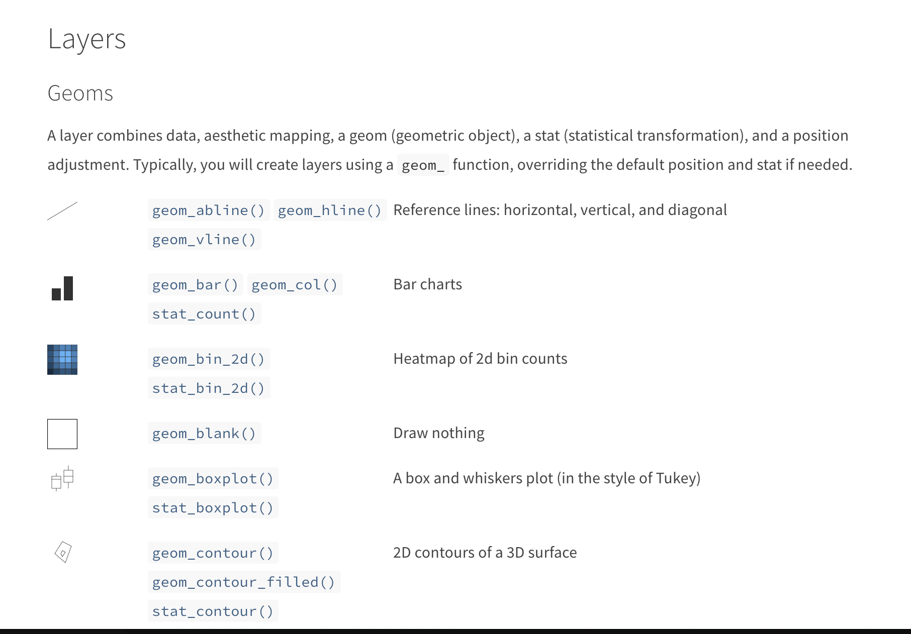

class: center, middle

```{r setup, include=FALSE}
pacman::p_load(xaringanthemer, here, jpeg, tidyverse, kableExtra, ggpubr, ggdist, palmerpenguins, patchwork)
knitr::opts_chunk$set(warning = FALSE, 
                      message = FALSE, 
                      comment = FALSE)
theme_set(theme_grey(base_size = 18)) 
```

```{r xaringan-themer, include=FALSE, warning=FALSE}

style_mono_accent(base_color = "#A42339",
                  code_highlight_color = "#BADEFC",
                  base_font_size = "18px",
                  text_font_size = "1rem",
                  text_slide_number_font_size = "0.8rem",
                  code_font_size = "0.6rem",
                  code_inline_font_size = "0.6rem",
                  header_h1_font_size = "2.5rem",
                  header_h2_font_size = "2rem",
                  header_h3_font_size = "1.5rem",
                  header_font_google = google_font("Work Sans", "600"),
                  text_font_google = google_font("Work Sans", "300", "300i"),
                  code_font_google = google_font("Fira Mono")
)
```

```{r xaringanExtra, echo = FALSE}
# Progress bar
xaringanExtra::use_progress_bar(color = "#A42339", location = "bottom")

# Extra css classes
extra_css <- list(
  ".pull-left-narrow" = list("float" = "left",
                             "width" = "20%"),
  ".pull-right-wide" = list("float"  = "right",
                             "width" = "75%"),
  ".small" = list("font-size" = "90%"),
  ".tiny" = list("font-size"  = "50%"),
  ".big" = list("font-size"   = "120%"),
  ".huge" = list("font-size"  = "150%"),
  ".full-width" = list("display" = "flex",
                       "width"   = "100%",
                       "flex"    = "1 1 auto"),
  ".content" = list("position"   = "relative",
                    "top"        = "50%",
                    "transform"  = "translateY(-50%)",
                    "text-align" = "center")
)

style_extra_css(css = extra_css, outfile = "custom.css")

# set engines
knitr::knit_engines$set("markdown")
xaringanExtra::use_tile_view()
```

# `r rmarkdown::metadata$title`
### `r rmarkdown::metadata$subtitle`

```{r image_tidyverse, fig.show = "hold", out.width = "10%", fig.align = "default", echo=FALSE}
knitr::include_graphics("https://raw.githubusercontent.com/rstudio/hex-stickers/master/PNG/tidyverse.png")
knitr::include_graphics("https://raw.githubusercontent.com/rstudio/hex-stickers/master/PNG/ggplot2.png")
```

`r rmarkdown::metadata$institute`

Ignacio Spiousas
[`r icons::icon_style(icons::fontawesome("github"), fill = "#A42339")`](https://github.com/spiousas) [`r icons::icon_style(icons::fontawesome("twitter"), fill = "#A42339")`](https://twitter.com/Spiousas)

Pablo Etchemendy
[`r icons::icon_style(icons::fontawesome("github"), fill = "black")`](https://github.com/https://github.com/petcheme) [`r icons::icon_style(icons::fontawesome("twitter"), fill = "#black")`](https://twitter.com/petcheme)

**Agosto 2021**

---
class: left, top, highlight-last-item
# ggplot2 `r emo::ji("graph")`

```{r image_ggplot, fig.show = "hold", out.width = "20%", fig.align = "center", echo=FALSE}
knitr::include_graphics("https://raw.githubusercontent.com/rstudio/hex-stickers/master/PNG/ggplot2.png")
```

En esta breve presentación vamos a hablar un poco de geometrías más complejas, como algunas **geoms_** y **stats_**

---
class: left, top, highlight-last-item
# geom_bar()

Con **geom_col()** hay que calcular la media antes.

.pull-left[
```{r bar1, eval = FALSE}
penguins %>%
    group_by(species) %>%
    summarise(mMass = mean(body_mass_g,
                           na.rm = TRUE)) %>%
    ggplot(aes(x = species,
               y = mMass,
               fill = species)) +
    geom_col() #<<
```
]

.pull-right[
```{r bar1-out, ref.label="bar1", fig.align = "center", dpi=300, fig.width = 6, fig.height = 4, out.width = "80%", echo=FALSE}
```
]

Usando **geom_bar()** se calcula la media de la magnitud en **y** para cada valor de **x**

.pull-left[
```{r bar2, eval = FALSE}
penguins %>%
    ggplot(aes(x = species,
               y = body_mass_g,
               fill = species)) +
    geom_bar(fun = "mean", #<<
             stat = "summary") #<<
```
]

.pull-right[
```{r bar2-out, ref.label="bar2", fig.align = "center", dpi=300, fig.width = 6, fig.height = 4, out.width = "80%", echo=FALSE}
```
]

---
class: left, top, highlight-last-item
# stat_count

**stat_count** cumple la misma tarea que **geom_bar()** pero contando los casos

.pull-left[
```{r count1, eval = FALSE}
penguins %>%
    group_by(species) %>%
    summarise(N = n()) %>%
    ggplot(aes(x = species,
               y = N,
               fill = species)) +
    geom_col() #<<
```
]

.pull-right[
```{r count1-out, ref.label="count1", fig.align = "center", dpi=300, fig.width = 6, fig.height = 4, out.width = "80%", echo=FALSE}
```
]

Podemos reemplazar ese pipe con esto:

.pull-left[
```{r count, eval = FALSE}
penguins %>%
  ggplot(aes(x = species,
             fill = species)) +
  stat_count() #<<
```
]

.pull-right[
```{r count-out, ref.label="count", fig.align = "center", dpi=300, fig.width = 6, fig.height = 4, out.width = "80%", echo=FALSE}
```
]   

---
class: left, top, highlight-last-item
# stat_summary

Usando **stat_summary()** agrega de alguna forma la magnitud en **y** para cada valor de **x**

Por ejemplo, podemos calcular la media y el error estándar:

.pull-left[
```{r summary1, eval = FALSE}
penguins %>%
    ggplot(aes(x = species,
               y = body_mass_g,
               color = species)) +
    stat_summary(fun.data = mean_se) #<<
```
]

.pull-right[
```{r summary1-out, ref.label="summary1", fig.align = "center", dpi=300, fig.width = 6, fig.height = 4, out.width = "75%", echo=FALSE}
```
]

O en formato barra:

.pull-left[
```{r summary2, eval = FALSE}
penguins %>%
  ggplot(aes(x = species,
               y = body_mass_g,
               fill = species)) +
  stat_summary(fun.data = mean_se, #<<
                 geom = "bar") + #<< 
  stat_summary(fun.data = mean_se, #<<
                 geom = "errorbar") #<<
```
]

.pull-right[
```{r summary2-out, ref.label="summary2", fig.align = "center", dpi=300, fig.width = 6, fig.height = 4, out.width = "75%", echo=FALSE}
```
]

---
class: left, top, highlight-last-item
# geom_boxplot

Un boxplot muestra de forma compacta la distribución de una variable continua.

Es posible visualizar la **mediana**, el **IQR** y los **Outliers**

.pull-left[
```{r boxplot1, eval = FALSE}
penguins %>%
  ggplot(aes(x = species,
             y = body_mass_g,
             color = species)) +
  geom_boxplot() #<<
```
]

.pull-right[
```{r boxplot1-out, ref.label="boxplot1", fig.align = "center", dpi=300, fig.width = 6, fig.height = 4, out.width = "75%", echo=FALSE}
```
]

También lo podemos usar para ver los datos y las estadísticas descriptivas

.pull-left[
```{r boxplot2, eval = FALSE}
penguins %>%
  ggplot(aes(x = species,
               y = body_mass_g,
               color = species)) +
  geom_boxplot(outlier.shape = NA) + #<<
  geom_jitter(width = 0.2) #<<
```
]

.pull-right[
```{r boxplot2-out, ref.label="boxplot2", fig.align = "center", dpi=300, fig.width = 6, fig.height = 4, out.width = "75%", echo=FALSE}
```
]

???
Mencionar que se puede ajustar el criterio de outliers en base al IQR
---
class: left, top, highlight-last-item
# geom_violin

**geom_violin()** nos permite graficar un **violin plot** de los datos

Un **Violin plot** es una forma compacta de mostrar una distribución continua

Es una mezcla entre un **geom_boxplot()** y **geom_density()**

.pull-left[
```{r violin, eval = FALSE}
penguins %>%
    ggplot(aes(x = species,
               y = body_mass_g,
               fill = species)) +
    geom_violin() #<<
```
]

.pull-right[
```{r violin-out, ref.label="violin", fig.align = "center", dpi=300, fig.width = 8, fig.height = 6, out.width = "100%", echo=FALSE}
```
]

Combinado con los datos crudos podemos hacer un **raincloud plot**, pero esa es historia para más adelnte

---
class: left, top, highlight-last-item
# geom_smooth

**geom_smooth** ayuda a ver patrones en nubes de puntos suporponiendo una capa suavizada

.pull-left[
```{r smooth1, eval = FALSE}
penguins %>%
  filter(species == "Adelie") %>%
  ggplot(aes(x = bill_length_mm,
             y = bill_depth_mm)) +
  geom_point() + 
  geom_smooth() #<<
```
]

.pull-right[
```{r smooth1-out, ref.label="smooth1", fig.align = "center", dpi=300, fig.width = 8, fig.height = 6, out.width = "75%", echo=FALSE}
```
]

Se puede forzar la **geometrìa** de esa capa

.pull-left[
```{r smooth2, eval = FALSE}
penguins %>%
  filter(species == "Adelie") %>%
  ggplot(aes(x = bill_length_mm,
             y = bill_depth_mm)) +
  geom_point() + 
  geom_smooth(se = FALSE, #<<
              method = lm) #<<
```
]

.pull-right[
```{r smooth2-out, ref.label="smooth2", fig.align = "center", dpi=300, fig.width = 8, fig.height = 6, out.width = "75%", echo=FALSE}
```
]

---
class: left, top, highlight-last-item
# geom_hex

**geom_hex** divide el plano en polígonos regulares y cuenta la candidad de casos en cada **bin**

Es una especie de **histograma bidimensional** o **heathmap discreto**

```{r hex, eval = FALSE}
penguins %>%
  filter(species == "Adelie") %>%
  ggplot(aes(x = bill_length_mm,
             y = bill_depth_mm)) +
  geom_hex(binwidth = c(1, 0.5)) #<<
```


```{r hex-out, ref.label="hex", fig.align = "center", dpi=300, fig.width = 8, fig.height = 6, out.width = "40%", echo=FALSE}
```

---
class: left, top, highlight-last-item
# Para seguir investigando...

Pueden seguir investigando más **geoms**, capas y escalas [acá](https://ggplot2.tidyverse.org/reference/)


---
class: center, top
# Referencias

.left[.big[
- Nordmann, E., McAleer, P., Toivo, W., Paterson, H., & DeBruine, L. (2021). Data visualisation using R, for researchers who don't use R.

- Wickham, H. (2011). ggplot2. Wiley Interdisciplinary Reviews: Computational Statistics, 3(2), 180-185.

]]