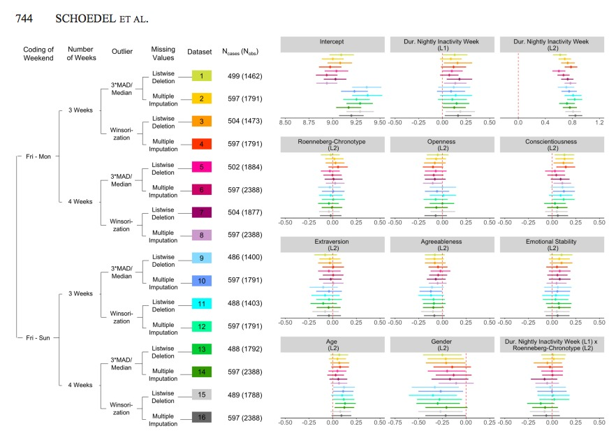

class: center, middle

```{r setup, include=FALSE}
pacman::p_load(xaringanthemer, tidyverse, kableExtra, ggpubr, palmerpenguins)
knitr::opts_chunk$set(warning = FALSE, 
                      message = FALSE)
```

```{r xaringan-themer, include=FALSE, warning=FALSE}
style_duo_accent(primary_color = "#A42339",
                 secondary_color = "#BADEFC",
                 code_highlight_color = "#BADEFC",
                 base_font_size = "18px",
                 text_font_size = "1rem",
                 text_slide_number_font_size = "0.8rem",
                  code_font_size = "0.7rem",
                  code_inline_font_size = "0.7rem",
                 header_h1_font_size = "2.5rem",
                 header_h2_font_size = "2rem",
                 header_h3_font_size = "1.5rem",
                 header_font_google = google_font("Work Sans", "600"),
                 text_font_google = google_font("Work Sans", "300", "300i"),
                 code_font_google = google_font("Fira Mono")
)
```

```{r xaringanExtra, echo = FALSE}
# Progress bar
xaringanExtra::use_progress_bar(color = "#A42339", location = "bottom")

# Extra css classes
extra_css <- list(
  ".pull-left-narrow" = list("float" = "left",
                             "width" = "20%"),
  ".pull-right-wide" = list("float"  = "left",
                             "width" = "75%"),
  ".small" = list("font-size" = "90%"),
  ".tiny" = list("font-size"  = "60%"),
  ".big" = list("font-size"   = "120%"),
  ".huge" = list("font-size"  = "200%"),
  ".full-width" = list("display" = "flex",
                       "width"   = "100%",
                       "flex"    = "1 1 auto"),
  ".content" = list("position"   = "relative",
                    "top"        = "50%",
                    "transform"  = "translateY(-50%)",
                    "text-align" = "center"),
  ".content-box-blue" = list("background-color" = "#F0F8FF",
                             "border-radius"    = "15px",
                             "margin"           = "0 0 25px",
                             "overflow"         = "hidden",
                             "padding"          = "20px",
                             "width"            = "100%")
)

style_extra_css(css = extra_css, outfile = "custom.css")

# set engines
knitr::knit_engines$set("markdown")
xaringanExtra::use_tile_view()
```

# `r rmarkdown::metadata$title`
### `r rmarkdown::metadata$subtitle`

```{r image_tidyverse, fig.show = "hold", out.width = "10%", fig.align = "default", echo=FALSE}
knitr::include_graphics("https://store-images.s-microsoft.com/image/apps.30452.fc69964a-ee5f-42b8-a4c8-991d2de54619.2becd730-7561-4858-a056-a80edf409286.a6d633cc-38c8-4819-984c-890c6a7afd46.png")
```

`r rmarkdown::metadata$institute`

Ignacio Spiousas
[`r icons::icon_style(icons::fontawesome("github"), fill = "#A42339")`](https://github.com/spiousas) [`r icons::icon_style(icons::fontawesome("twitter"), fill = "#A42339")`](https://twitter.com/Spiousas)

Pablo Etchemendy
[`r icons::icon_style(icons::fontawesome("github"), fill = "black")`](https://github.com/https://github.com/petcheme) [`r icons::icon_style(icons::fontawesome("twitter"), fill = "#black")`](https://twitter.com/petcheme)

`r Sys.Date()`

---
class: center, top, highlight-last-item
# ¿Outliers = Valores extremos?


???
Los valores atípicos son puntos de datos que están extremadamente distantes de la mayoría de los otros puntos de datos.

"Grados de libertad del investigador"

Por tanto, es importante que los investigadores decidan cómo gestionarán los valores atípicos antes de recopilar los datos y comprometerse con este plan preestablecido.

---
class: left, top, highlight-last-item
# ¿Qué es un outlier?

> "Data values that are unusually large or small 
> compared to the other values of the same construct"
>
> Aguinis et al. 2013

--
<br>
<br>
<br>
<br>

Una posible clasificación de los **Outliers**:

<br>
```{r, echo = FALSE}
tibble(Tipo = c("**Error**", "**Interesante**", "**Aleatorio**"),
       Descripción = c("P.ej. Un error de codificación", 
                       "P.ej. Un Moderador subyacente a un proceso potencialmente interesante", 
                       "P.ej. Un valor muy grande para una dada distribución")) %>%
  kbl() %>%
  kable_styling()
```
.tiny.center[Adaptado de *Leys et al. 2019* y *Aguinis et al. 2013*]

???
Ejemplo de **error outlier**: Un valor "77" en una escala Likert que va de 1 a 7 es un error atípico, causado por presionar accidentalmente el "7" dos veces al ingresar manualmente los datos.

Ejemplo de **interesting outlier**: Considere una persona que exhibiría un nivel muy alto de identificación dentro del grupo pero un nivel muy bajo de prejuicio hacia un grupo externo específico. Esto contaría como un valor atípico según la teoría de que la identificación de grupo conduce a prejuicios hacia los grupos externos relevantes. Detectar a esta persona y tratar de determinar por qué este es el caso puede ayudar a descubrir posibles moderadores de la suposición un tanto simplista de que la identificación conduce al prejuicio

Ejemplo de **random outlier**: Los valores atípicos de andom son valores que aparecen aleatoriamente por pura (des) suerte, como una moneda perfectamente equilibrada que rinde 100 veces "cara" en 100 lanzamientos.

---
class: left, top, highlight-last-item
# Outliers univariados y multivariados

.pull-left[
.center[
]]

.pull-left.big[
Un individuo de esta muestra de **175 cm** de altura no es un outlier

Tampoco uno de **45 Kg** de peso

Pero, uno de **175 cm** de altura **Y 45 Kg** de peso probablemente sí

Eso es, de manera simple, un **outlier multivariado**
]

---
class: left, top, highlight-last-item
# Por qué los outliers son importantes

.big.center[**1**. Detectar los posibles candidatos]

.pull-left[
.right[]
]

.pull-right[
Una muestra de 10 tiradas de dado con 10 caras puede ser un dado cargado o, simplemente una posibilidad... 

¿Cómo lo identificamos? **Buena pregunta**
]

--
<br>
.big.center[
**2**. Decidir si conservarlos o removerlos (basados en información **no matemática**)
]

???
Discutir el tema de que los valores extremos, si vienen de la distribución (una moneda no alterada) son fuentes "legitimas" de varianza y no habría por qué quitarlos.

Desafortunadamente, la mayoría de las veces, uno no tiene forma de saber de qué distribución proviene una observación.

---
class: left, top, highlight-last-item
# Cómo detectar posibles outliers

Los datos que están fuera del intervalo **media +/- 3.29 SD** (te quedas con el 99%)

Todo muy lindo, pero... ¿Qué pasa con la media cuando sumamos outliers?

--
.pull-left[
Un pequeño "experimento":

```{r}
mean(c(1, 2, 3, 5, 6, 7))
```

```{r}
mean(c(1, 2, 3, 5, 6, 7, 1000))
```

```{r}
mean(c(1, 2, 3, 5, 6, 7, 1000, 1000))
```

```{r}
mean(c(1, 2, 3, 5, 6, 7, 1000, 1000, 1000))
```

Se entiende ¿No?
]

--
.pull-right[
En cambio, nada le gana a la buena **mediana** para medir la tendencia central

```{r}
median(c(1, 2, 3, 5, 6, 7))
```

```{r}
median(c(1, 2, 3, 5, 6, 7, 1000))
```

```{r}
median(c(1, 2, 3, 5, 6, 7, 1000, 1000))
```

```{r}
median(c(1, 2, 3, 5, 6, 7, 1000, 1000, 1000))
```
]

???
La mediana, al igual que la media, es una medida de la tendencia central pero ofrece la ventaja de ser muy poco sensible a la presencia de outliers.

El equivalente de la media para multivariados: Distancia de Mahalanobis. Valores muy lejanos a un centroide (te quedas, por ejemplo, con el 99%).

Esta circularidad en la detección de outliers basada en estadísticas que están influenciadas por los outliers puede prevenirse mediante el uso de indicadores sólidos de outliers. 

---
class: left, top, highlight-last-item
# Cómo detectar posibles outliers

.big[
Los métodos basados en la media tienen 3 problemas:

<br>

.center[
**1**. Al ser métodos que dependen de la media no es ideal yq ue la media puede ser muy influenciada por los outliers mismos

**2**. Además asume que la distribución es normal

**3**. Difícil que detecte outliers en muestras pequeñas (relacionado con 1)
]]

---
class: left, top, highlight-last-item
# Cómo detectar posibles outliers

Veamos un ejemplo:
```{r}
data <- c(1, 2, 3, 5, 6, 7, 1000) 
```

.pull-left[
Con la **media** y 3 **SD**
```{r}
mean(data)
```

```{r}
sd(data)
```

```{r}
limits_mean <- c(mean(data) - 3 * sd(data),
                 mean(data) + 3 * sd(data))
limits_mean
```
]

.pull-right[
Con la **mediana** y 2.225 **IQR**
```{r}
median(data)
```

```{r}
quantile(data)
```

```{r}
limits_median <- c(median(data) - 2.225 * IQR(data),
                   median(data) + 2.225 * IQR(data))
limits_median
```
]

Al ser un dataset pequeño y estar la **media** y la **SD** muy influenciada por el **1000** no lo consideramos outlier

???
La elección de *2.225* es porque si tenemos una distribución normal es el equivalente a 3 SD

---
class: left, top, highlight-last-item
# Un método de detección

Una variante del uso de la mediana y el **IQR** es el uso del **MAD (median absolute deviation)** 

.pull-left[
Usando **MAD** univariado
```{r}
data <- c(1, 2, 3, 5, 6, 7, 40) 
```

$MAD(X) = 1.48 median(\sum_i [x_i-median(X)])$
```{r}
# install.packages("Routliers")
library(Routliers)
outliers <- outliers_mad(data)
outliers
```
]

.pull-right[
```{r, fig.align = "center", dpi=300, fig.width = 6, fig.height = 5, out.width = "100%"}
plot_outliers_mad(outliers, x = data)
```
]
???
El MAD Es una especie de mediana de las distancias a la mediana y es MUY robusto,

Es mejor que el intercuartil porque si tuvieramos más del 25% de los datos outliers el IQR se vería afectado por esto mientras que el MAD no.

La detección de valores atípicos es un procedimiento que se aplica solo una vez a un conjunto de datos. Un error común es detectar valores atípicos, administrarlos (por ejemplo, eliminarlos o volver a codificarlos) y luego volver a aplicar el procedimiento de detección de valores atípicos en el nuevo conjunto de datos modificado.

---
class: left, top, highlight-last-item
# Un método de detección

También sirve para outliers multivariados (**MCD**)

```{r}
altura <- c(1.5, 1.7, 1.6, 1.8, 1.6, 1.6, 1.9) # Metros
peso <- c(60,  72,  72,  79,  70,  63,  47) # Kg
```

.pull-left[
```{r}
outliers_altura <- outliers_mad(altura)
outliers_altura
```
]

.pull-right[
```{r}
outliers_peso <- outliers_mad(peso)
outliers_peso
```
]

---
class: left, top, highlight-last-item
# Un método de detección

También sirve para outliers multivariados (**MCD**)

```{r}
altura <- c(1.5, 1.7, 1.6, 1.8, 1.6, 1.6, 1.9) # Metros
peso <- c(60,  72,  72,  79,  70,  63,  47) # Kg
```

.pull-left[
```{r}
outliers_multi <- outliers_mcd(cbind(altura,
                                     peso))
outliers_multi
```
]

.pull-right[
```{r, fig.align = "center", dpi=300, fig.width = 6, fig.height = 5, out.width = "80%"}
plot_outliers_mcd(outliers_multi, x = cbind(altura,
                                     peso))
```
]
---
class: left, top, highlight-last-item
# Lidiando con outliers

.big[
Después de detectar los potenciales outliers tenemos que decidir qué hacemos con ellos
]
<br>
<br>

.huge.center[
**Conservar**  o **Remover** los outliers
]

<br>
<br>
.center.huge.content-box-blue[**Recuerden** que esta decisión no se puede calcular]


???
Los error outliers deben eliminarse cuando se detectan, ya que no son observaciones válidas de la población investigada. Tanto los outliers interesantes como los aleatorios se pueden mantener, recodificar o excluir. Idealmente, los outliers interesantes deben eliminarse y estudiarse en estudios futuros, y deben mantenerse los outliers aleatorios. Desafortunadamente, los datos brutos generalmente no permiten a los investigadores diferenciar fácilmente los outliers interesantes y aleatorios entre sí. En la práctica, recomendamos tratar a ambos de manera similar.

---
class: left, top, highlight-last-item
# Recomendaciones prácticas

.huge.center[
**SIEMPRE** explicitar **cómo** detectamos y **qué** hicimos con los **outliers**

De ser posible, **preregistrar** el plan de análisis de **outliers**

Si compartimos los **datos crudos**, incluir a los **outliers**
]


---
class: left, top, highlight-last-item
# Recomendaciones prácticas

.big.pull-left-narrow[
Y si no estamos seguros...
]

.pull-right-wide[
.center[
.tiny[*Schoedel et al. 2020*]
]
]

---
class: center, top
# Referencias

.left[.big[
- Leys, C., Delacre, M., Mora, Y. L., Lakens, D., & Ley, C. (2019). How to classify, detect, and manage univariate and multivariate outliers, with emphasis on pre-registration. International Review of Social Psychology, 32(1).

- Leys, C., Ley, C., Klein, O., Bernard, P., & Licata, L. (2013). Detecting outliers: Do not use standard deviation around the mean, use absolute deviation around the median. Journal of experimental social psychology, 49(4), 764-766.

- Aguinis, H., Gottfredson, R.-K., & Joo, H. (2013). Best-practice recommendations for defining, identifying, and handling outliers. Organizational Research Methods, 16(2), 270–301. 

- Schoedel, R., Pargent, F., Au, Q., Völkel, S. T., Schuwerk, T., Bühner, M., & Stachl, C. (2020). To challenge the morning lark and the night owl: Using smartphone sensing data to investigate day–night behaviour patterns. European Journal of Personality, 34(5), 733-752.
]]